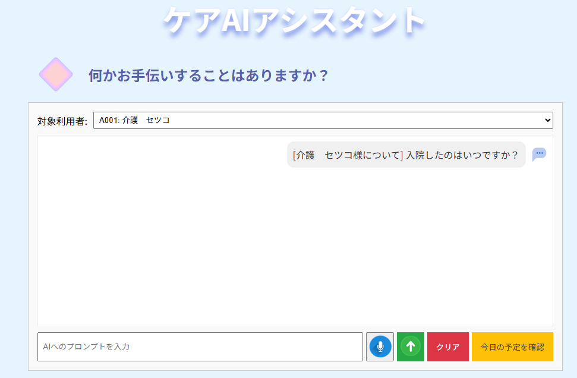

## 1.LPのタイトル
ケアAIアシスタント2

## 2.制作LPの説明（40文字程度）
前回の課題はfirebaseを使っていたが、PHPに変更して同様の動きを確認

## 3.工夫した点・こだわった点 
前回の課題と同様の動きができることを確認した

・Geminiにプロンプトを指定してそれらしい回答になるようにした

・登録したケア記録データの一覧が確認できるようにした

## 4.次回トライしたこと（または機能）
前回課題から引き続き以下に取り組んでいきたい

・cssの整理までたどり着けなかった

・本日の予定が未実装なので、動くようにする

・過去のケア記録が表示されない場合があるので解決できるようにする

・AIのプロンプトの変更を試す

・音声返答について確認する

## 5.備考（感想、シェアしたいこと等なんでも） 
・回答のAIの口調があんまり好みではないのでプロンプトを見直したかったが、Gemini API無償枠なので1日のリクエスト制限（Limit: 20）を超えてしまい途中でテストできなくなってしまった

・タロウ先生が言われていた通り、APIKeyをgithubにあげると光の速さでメールがきましたw

